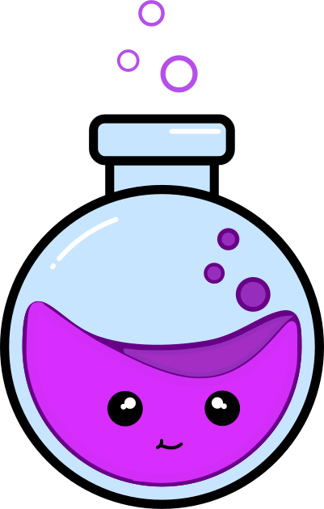
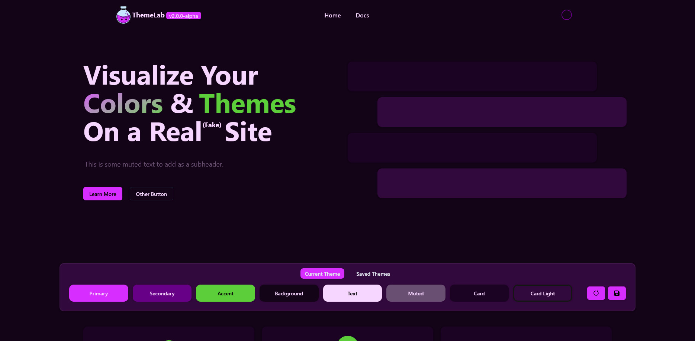

<p align="center">
<a href="https://themelab.stefischer.com"></a>
</p>

<h1 align="center">Theme Lab</h1>

<p align="center">Build and export themes to speed up your website color palette prototyping!</p>

<p align="center">
  This project took a lot of inspiration from <a href="https://realtimecolors.com">Realtime Colors</a>. 
  <br />Please consider supporting their project as well!
</p>

<p align="center">
    </img>
    </img>
</p>

<center>
<a href='https://ko-fi.com/O5O1YLP79' target='_blank'></a>
</center>

<p align="center">
  <a href="#how-to-run">How To Run</a> •
  <a href="#technologies-used">Technologies Used</a> •
  <a href="#license">License</a>
</p>



### What Does This Tool Solve?

Instead of trying to use online color palette or theme generators and updating a local "theme" object for each color, I wanted a simple and easy way to test out color schemes with instant feedback. This project uses my go to theming colors:
```
Primary | Secondary | Accent | Background | Text | Muted | Card | Card Light
```

### Feature List

- View color changes in realtime
- Visualize how colors look on a website
- Save themes for future reference
- Export / Import themes

### How To Run

- Install [bun](https://bun.sh/docs/installation#installing)
- At the root of the repository run
```bash
bun install
```
- To start the development server run
```bash
bun dev
```

### Technologies Used


### License

None